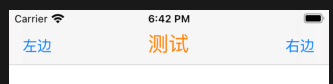
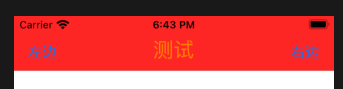
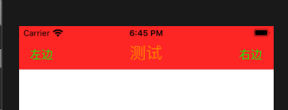

1. navigationBar.titleTextAttributes 可以设置标题样式

   ```swift
   navigationController?.navigationBar.titleTextAttributes = [.foregroundColor:UIColor.orange,
                                                                           .font:UIFont.systemFont(ofSize: 24)]
   ```

   

2. barTintColor可以设置navigationBar的背景颜色

   ```swift
   navigationController?.navigationBar.barTintColor = .red
   ```

   

3. tintColor可以设置navigationBar的UIBarButtonItem的文字颜色

   ```swift
   navigationController?.navigationBar.tintColor = .green
   ```

   

