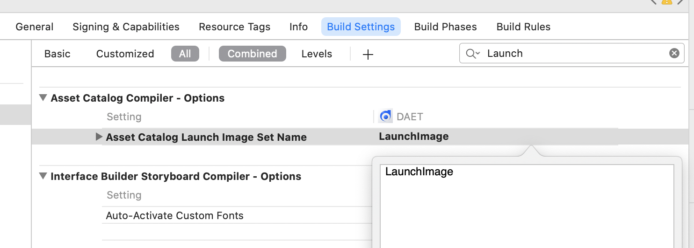

# 设置启动图细节

## LaunchImage(已经废弃)

在Assets.xcassets设置启动图
1、点击Assets.xcassets，然后点击Assets里面左下角的加号，然后选择iOS-->iOS Launch Image,如下图


2、然后在LaunchImage里面放置对应的图片

3、清空Launch Screen File，如下图


4、在Targets-->Build Setting 搜索Launch，把Asset Catalog Launch Image Set Name的值设置为刚刚创建的 LaunchImage，如下图



5、最后把LaunchScreen.storyboard 的 Use as Launch Screen和Use Safe Area Layout Guides 取消选中。

注：如果设置好了没有显示启动图，就把APP删除掉重新安装就好了

## LaunchScreen.storyboard

### 苹果审核新规

背景：WWDC在2019有session提出。到2020年4月，上架APP的启动页必须使用launchscreen.storyboard，不能再使用assert方式了，后面延迟到了2020年6月，现在6月已过，就来说下launchscreen.storyboard的使用以及里面遇见的坑。

### 使用LaunchScreen.storyboard搭建启动图

1、首先，要在项目中进行配置。在General—> App Icons and Launch Images—>Launch Screen File中选择LaunchScreen


2、然后，在Build Settings—>Asset Catalog Launch Image Set Name 中将值置空（如果以前没用assert方式设置启动图，默认为空）


3、选中LaunchScreen.storyboard，勾选Use as Launch Screen的选项，注意此时不要取消Use Safe Area Layout Guides选项。（尽管你的项目适配iOS9.0以下会报错，先不要管，如果取消了在后面布局设置中左右会有20像素的留白）


4、添加UIImageView控件


5、为新添加的UIImageView


6、选中上下左右的约束（点击短横线），并将数值都设为0，最后点击下面的Add按钮，如下图所示:


7、此时选中带刘海屏的手机模型，你会发现上下还是有留白

8、解决留白问题，在左窗口选中底部约束—>点击右侧的First item—>选择Superview—>将Constant设置为0，同样的方式，修改顶部约束：注意此时需要将 Second item—>选择Superview

9、此时将3中提到的Use Safe Area Layout Guides选项取消勾选，然后再将自己的启动图名称添加上就可以了


### 三、图片适配

以前使用LaunchImage方式的时候，使用LaunchImage可以根据不同的屏幕设置不同的图片，现在只能用1倍、2倍、3倍图了，但是8P和11P max都是3倍图，高度却不一样了，如果不做处理用同一张图片会出现留白情况。
 1、简单粗暴处理。在Content Mode—>选择Scale To Fill或者Aspect Fill,让图片自己压缩。Scale To Fill会改变图片宽高比，Aspect Fill会造成图片显示不全。

2、类似LaunchImage适配。

2.1、选择Assets.xcassets—>左下角+号—>New Image Set.然后自己命一个名字


2.2、修改图片的Contents.json文件，修改内容如下（双击图片，选择Show in Finder,文件夹里面有一个Contents.json文件，双击打开）

```json
{
  "images" : [
    {
      "idiom" : "iphone",
      "scale" : "1x"
    },
    {
      "idiom" : "iphone",
      "scale" : "2x"
    },
    {
      "idiom" : "iphone",
      "scale" : "3x"
    },
    {
      "idiom" : "iphone",
      "scale" : "1x",
      "subtype" : "retina4"
    },
    {
      "idiom" : "iphone",
      "scale" : "2x",
      "subtype" : "retina4"
    },
    {
      "idiom" : "iphone",
      "scale" : "3x",
      "subtype" : "retina4"
    },
    {
      "idiom" : "iphone",
      "scale" : "3x",
      "subtype" : "736h"
    },
    {
      "idiom" : "iphone",
      "scale" : "2x",
      "subtype" : "667h"
    },
    {
      "idiom" : "iphone",
      "scale" : "3x",
      "subtype" : "2436h"
    },
    {
      "idiom" : "iphone",
      "scale" : "3x",
      "subtype" : "2688h"
    },
    {
      "idiom" : "iphone",
      "scale" : "2x",
      "subtype" : "1792h"
    }
  ],
  "info" : {
    "author" : "xcode",
    "version" : 1
  }
}
```

2.3、此时就可以根据不同屏幕适配不同的启动图了


### 四：启动图没出来

可以尝试重启Xcode、删除app重装等。

### 五：修改启动图

在原来的文件下面替换图片，不管沙盒删启动图缓存、删除app重装、清理Xcode、重启Xcode、重启电脑都没用，只有一个办法，重启手机。所以我更换启动图就是换一个图片名称，在Assets.xcassets里面重新建一个图片文件夹，重新添加图片。

注意，如果图片显示不了：

- retina4是对4寸屏幕的适配，也就是苹果5系列和第一代se， 这类机型只有2x图，但是这种写法会默认生成1x、2x、3x，直接用320*568图片去适配
- 查看自己是否有步骤缺失
- 查看自己项目以前是否使用LaunchImage，如果是，是否将LaunchImage相关已经全部删除
- 重启手机试下

### 六：iPhone12系列

因为我的方法是通过LaunchImage衍生出来的，iPhone12出来前LaunchImage已被禁用，所以Xcode没有iPhone12启动图对应的设置，故没办法在Contents.json文件进行相应的设置。
 iPhone12系列解决方案（比较投机）：
 iPhone12用的都是3倍图，而在Contents.json文件中没有针对iPhone12的设置，所有，他会使用对应的3x图。可以发现3x图在以前机型是没有被使用的，所有可以通过3x图在进行iPhone12的启动图设置，而iPhone12机型的宽高比是固定的，所以这里面设置好也不会出现图片被拉伸或者显示不全等问题。


iPhone12系列开发尺寸：
12 min         375 * 812
12 AND 12 Pro  390 * 844
12 Pro Max      428 * 926

