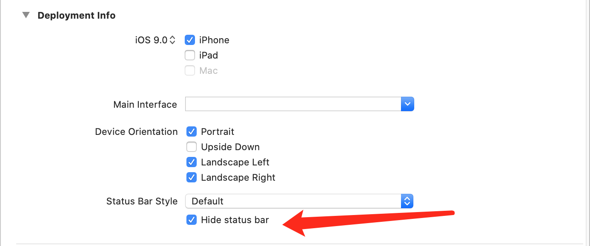

# Hide Status Bar的细节

在Xcode中General -> 勾选 Hide Status Bar **可以启到启动页隐藏状态栏的效果**。但是这个勾选并不会影响全局的ViewController的状态的展示。



因为每个ViewController都是通过两个方法来状态栏展示的。

```swift
override var prefersStatusBarHidden: Bool {
  true
}
override var preferredStatusBarStyle: UIStatusBarStyle {
  //.darkContent
  .lightContent
}
```

如果想让全局ViewController隐藏Status Bar。除了勾选 Hide Status Bar，info.plist的View controller-based status bar appearance，设置为NO。

让每个ViewController单独控制ViewController，配置上 info.plist->View controller-based status bar appearance删掉或者设置为YES即可。

