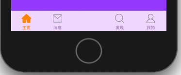

# tabbar添加自定义按钮

示例：


思路：

1. 首先可以添加一个空白ViewController，为撰写按钮占位

   

2. 在tabbar上添加自定义的按钮

   ```swift
   tabBar.addSubview(composeButton)
   ```

3. 设置自定义按钮的frame

   ```swift
   // 获取子控制器的数量
   let count = CGFloat(children.count)
   // 计算每个tabbarItem的宽度，
   // -1是为了避免偶尔点击tabbar之间的空白区域导致空白ViewController展示
   let w = tabBar.bounds.width / count - 1
   composeButton.frame = tabBar.bounds.insetBy(dx: 2 * w, dy: 0)
   ```

## CGRectInset

OC中一个结构体：

```objc
CGRectInset CGRect CGRectInset (
	CGRect rect,
	CGFloat dx,
	CGFloat dy
);
```

该结构体的应用是以原rect为中心，再参考dx，dy，进行缩放或者放大。正数是缩小，负数是扩大

示例：

```swift
//Swift
composeButton.frame = tabBar.bounds.insetBy(dx: 2 * w, dy: 0)
```

```objc
// OC
composeButton.frame = CGRectInset(tabbar.bounds, 2 * w, 0);
```


