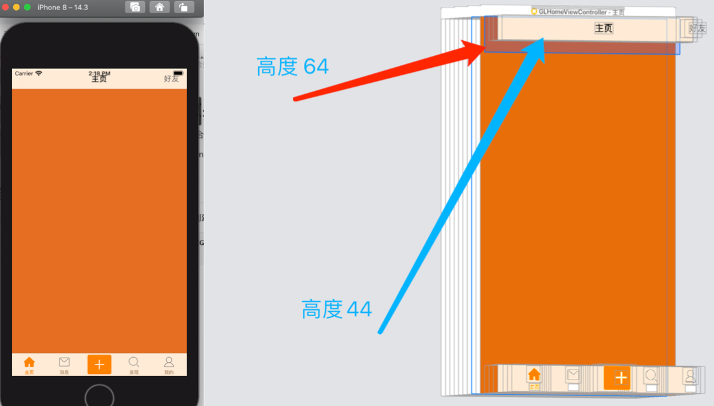

# NavigationBar非融合效果的设置

系统的NavigationBar是融合的效果，但一般都要求非融合效果。要达到这种非融合效果一般方式有两种：

* 隐藏系统的NavigationBar，使用自定义的NavigationBar
* 使用第三方库

## 自定义NavigationBar

因为创建的 UINavigationBar 高度是固定的，44。直接创建并指定高度，页面上效果并不好。

```swift
let navigationBar = UINavigationBar(frame:CGRect(x: 0, y: 0, width: view.bounds.width, height: 64)
view.addSubView(navigationBar)
```



所以这里采用继承自UIView，自定义NavigationBar。在内部使用UINavigationBar

```swift
class GLNavigationBar: UIView {
    
    private lazy var navigationBar = UINavigationBar()
    
    /// 公开navigationBar的items方法
    var items: [UINavigationItem]? {
        didSet {
            navigationBar.items = items
        }
    }
    
    /// 重写frame的setter
    override var frame: CGRect {
        didSet {
            let y = frame.height - 44
            navigationBar.frame = CGRect(x: 0, y: y, width: frame.width, height: 44)
        }
    }
    
    override init(frame: CGRect) {
        super.init(frame: frame)
        setupUI()
    }
    
    required init?(coder: NSCoder) {
        super.init(coder: coder)
    }
}


// MARK: - 界面设置
extension GLNavigationBar {
    /// 设置导航栏
    private func setupUI() {
        addSubview(navigationBar)
        let y = frame.height - 44
        navigationBar.frame = CGRect(x: 0, y: y, width: frame.width, height: 44)
        //设置和UINavigationBar一样的北京颜色
        setColor(UIColor.cz_color(withHex: 0xF6F6F6))
    }
}

// MARK: - public
extension GLNavigationBar {
    
    /// 设置导航栏颜色
    /// - Parameter color: color
    func setColor(_ color: UIColor) {
        backgroundColor = color
        // 通过颜色生成一张纯色图片，来达到修改导航栏颜色的问题。
        navigationBar.setBackgroundImage(UIImage.image(color: color), for: .default)
        // 去掉黑线
        navigationBar.shadowImage = UIImage()
    }
}
```

## 使用第三方

[RTRootNavigationController](https://github.com/rickytan/RTRootNavigationController) 